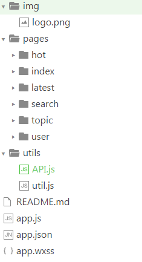

## 微信小程序 简易版V2EX社区

感谢V2EX社区提供的接口

有3个基本功能,查看热议的话题,查看最新的话题和通过用户名查询用户信息.
使用小程序提供的发起请求,列表渲染,页面跳转,显示提示等API[小程序文档](https://mp.weixin.qq.com/debug/wxadoc/dev/index.html)


## 示例

  

## 项目结构图




## Useage

```bash
git clone git@github.com:xrr2016/V2EX.git
```

使用微信小程序开发工具打开文件夹

## License
   MIT

written by [xrr2016](https://github.com/xrr2016) 欢迎 issue,fork,star
